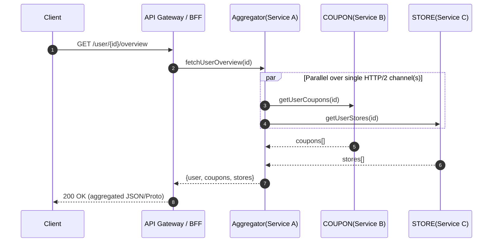

# gRPC vs REST in MSA — 동기/비동기, 멀티플렉싱, 스텁 한 번에 정리
_2025-08-20_

---
- **gRPC는 “동기 패턴만”이 아님**: 기본 `BlockingStub`이 동기(블로킹)이어서 책에서 그렇게 표현될 수 있지만, **비동기/스트리밍**도 1급으로 지원합니다.
- **멀티플렉싱(HTTP/2)**: **하나의 TCP 연결**에서 **여러 요청/응답 스트림을 동시 처리**합니다. 새로운 연결을 계속 열지 않아도 되어 **지연·오버헤드 감소**.
- **“한 요청으로 여러 서비스 호출”이 아님**: 멀티플렉싱은 **연결 재사용/동시 처리**를 의미할 뿐, COUPON/STORE 등 **각 서비스에는 여전히 각자 요청**을 보냅니다(보통 **Aggregator**에서 병렬 호출).
- **gRPC가 유리한 곳**: 내부 마이크로서비스 간 **고RPS/저지연**, **강한 스키마(Proto)**, **양방향/서버 스트리밍**.
- **REST가 유리한 곳**: **브라우저/공개 API**, **캐싱/디버깅/에코시스템**, **단순 통합**.
- **Spring 실무 포인트**: 채널은 **재사용**하고, **비동기 Stub**로 병렬화, **LB의 HTTP/2 지원 확인**, 타임아웃/리트라이/백오프/메시지 크기 튜닝.

---

## 1) 용어 한 줄 정의
- **RPC**: 원격 프로시저를 **로컬 함수처럼** 호출하기 위한 규약/프레임워크.
- **gRPC**: HTTP/2 + Protocol Buffers(바이너리) 기반의 **고성능 RPC** 프레임워크.
- **Stub(스텁)**: **클라이언트 대리자 코드**. 로컬 메서드처럼 보이지만 네트워크로 원격 호출을 전송/응답 수신.
- **멀티플렉싱**: **하나의 연결**에 **여러 논리 스트림**을 태워 **동시**로 흘려보내는 기술(HTTP/2 기본 기능).
- **Blocking vs Async Stub**: 응답을 **기다리면 Blocking**, **기다리지 않으면 Async**. gRPC는 둘 다 제공.

---

## 2) gRPC는 왜 빠르게 느껴질까?
1) **바이너리 직렬화(ProtoBuf)** ⇒ JSON 대비 **작고 빠른** 직렬화/역직렬화.
2) **HTTP/2 멀티플렉싱 + 헤더 압축(HPACK)** ⇒ 하나의 연결에서 **동시 요청/응답**, 헤더 오버헤드 감소.
3) **연결 재사용/장수 연결** ⇒ 매 요청마다 TCP/TLS 핸드셰이크 비용을 줄임.
4) **스트리밍** ⇒ 서버/클라이언트/양방향 스트림으로 **지연을 더 낮게** 유지.

> ⚠️ 주의: TCP 레벨 **HOL(Head-of-Line) 블로킹)**은 남아 있지만, HTTP/2 멀티플렉싱으로 **애플리케이션 레벨 큐 적체**를 크게 줄입니다.

---

## 3) “한 요청으로 세 서비스 호출된다”는 오해 풀기
- **사실**: 멀티플렉싱은 **연결(채널) 효율화**입니다. **COUPON/STORE/User** 같은 **여러 백엔드에 각자 요청**을 보내되, **하나의 HTTP/2 연결(또는 소수의 연결)** 안에서 **동시에 흘려보낼 수 있다**는 뜻입니다.
- **패턴**: 보통 **Aggregator(Compose) 서비스**가 내부적으로 **병렬 호출**하고, 응답을 **합쳐(merge)** 클라이언트에 **단일 응답**으로 반환합니다.



> 핵심: **요청은 여럿**이지만, **연결은 적고**, **동시에** 보낸다 ⇒ 총 소요시간이 **가장 느린 하나의 백엔드 지연**으로 수렴.

---

## 4) gRPC는 동기일까? 비동기일까?
- 책에서 “**동기 패턴**”이라고 서술된 건, **`BlockingStub` 중심의 기본 사용 흐름**을 말하는 경우가 많습니다.
- **현실**: gRPC는 **Blocking/Async/Streaming**을 모두 지원. 실무에서는 **Async + 병렬**이 성능 핵심.

### 예시: Java gRPC 클라이언트 (Blocking vs Async)
```java
// 1) Blocking (동기)
var channel = ManagedChannelBuilder.forAddress("coupon", 50051).usePlaintext().build();
var blocking = CouponServiceGrpc.newBlockingStub(channel);
CouponResponse res = blocking.getUserCoupons(CouponRequest.newBuilder().setUserId(id).build());

// 2) Async (비동기, CompletableFuture로 감싸기)
var async = CouponServiceGrpc.newFutureStub(channel);
var future = async.getUserCoupons(CouponRequest.newBuilder().setUserId(id).build());
future.addListener(() -> {
    // 응답 처리 (future.get())
}, executor);
```

---

## 5) Spring에서의 선택지 & 팁
### A. gRPC (내부 서비스 고성능 통신)
- **의존성**: `grpc-netty-shaded`, `protobuf-java`, (선택) `yidongnan/grpc-spring-boot-starter`
- **권장**: 채널 **재사용**, `maxInboundMessageSize`, `keepAlive`, `deadline`(타임아웃), 리트라이/백오프 설정
- **LB 주의**: L4/L7이 **HTTP/2 풀 지원**하는지 확인(알프/프록시 구간에서 H2→H1 다운그레이드 금지)

### B. Feign / WebClient (HTTP 기반)
- **Feign**: 선언형 REST 클라이언트(동기/리본·LB 통합). 쉬운 도입/관찰가능성 높음.
- **WebClient**: 비동기/리액티브 호출에 유리. 외부 API 연동·브라우저/오픈API 친화.

### Aggregator에서 병렬화(예시: WebFlux + gRPC 혼합)
```java
Mono<CouponResponse> coupons = Mono.fromFuture(
    couponFutureStub.getUserCoupons(req)
);
Mono<StoreResponse> stores = Mono.fromFuture(
    storeFutureStub.getUserStores(req)
);

Mono<Overview> overview =
    Mono.zip(coupons, stores)
        .map(tuple -> merge(tuple.getT1(), tuple.getT2()));
```

---

## 6) 언제 gRPC, 언제 REST?
### gRPC 적합
- **서비스-투-서비스 내부 통신**, **고RPS/저지연**, **강타입 스키마(스키마 드리븐 개발)**
- **스트리밍**(서버/클라/양방향), **실시간 업데이트**(로그/텔레메트리)
- **일관된 인터페이스**와 **자동 코드 생성**이 중요한 대규모 다언어 조직

### REST 적합
- **공개 API/브라우저/모바일 웹**(gRPC-web은 별도 게이트웨이 필요)
- **캐싱/프록시/관찰성/디버깅**(curl, 브라우저 devtools, API 게이트웨이 생태계)
- **파트너 통합**(표준/문서/예제의 보급률이 매우 높음)

---

## 7) gRPC의 단점(실무 시 고려)
- **브라우저 직접 호출 어려움**: `gRPC-web` 또는 **API Gateway 변환** 필요
- **디버깅 난이도**: 이진 포맷이라 텍스트 기반 도구보다 관찰성 설정이 중요(인터셉터/메트릭/분산트레이싱)
- **스키마/버저닝 관리**: Proto의 **호환성 전략** 엄수(필드 예약/optional/naming)
- **인프라 의존성**: LB/프록시/사이드카가 **HTTP/2** **완전 지원**해야 함
- **메시지 크기/압축/흐름제어**: 큰 페이로드, 스트리밍 **백프레셔** 전략 필요

---

## 8) 멀티플렉싱 직관 그림
```mermaid
flowchart LR
  subgraph HTTP/1.1
    A1[Client]-- Conn-1 -->S1[Server]
    A2[Client]-- Conn-2 -->S1
    A3[Client]-- Conn-3 -->S1
  end
  subgraph HTTP/2 (Multiplexed)
    B1[Client]== Single Conn ==>S2[Server]
    B1== Stream#1 ==>S2
    B1== Stream#2 ==>S2
    B1== Stream#3 ==>S2
  end
```

- H1은 **요청 병렬화**를 위해 **연결을 여러 개** 열어야 하고(오버헤드↑)
- H2는 **하나의 연결**에 **여러 스트림**을 태워 동시 처리(오버헤드↓)

---

## 9) 실무 체크리스트
- [ ] **채널 재사용**(gRPC Channel 풀링/싱글톤)
- [ ] **Deadline/Timeout** 필수, **서킷브레이커/리트라이**는 지수백오프로
- [ ] **메시지 크기 상한/압축** 설정 (`maxInboundMessageSize`, gzip 등)
- [ ] **LB/프록시의 HTTP/2 지원** 점검(헬스체크도 H2)
- [ ] **관찰성**: 메트릭(성공/오류/지연 p99), 로깅, OpenTelemetry 트레이싱
- [ ] **스키마 호환성** 가이드(필드 예약, optional, 정수 타입 변경 금지 등)
- [ ] **백프레셔 전략**: 스트리밍 소비자가 느릴 때의 처리 정책

---

## 10) FAQ로 마무리
**Q. gRPC는 비동기만 가능한가요?**  
A. 아니요. **동기/비동기/스트리밍 모두 지원**합니다. `BlockingStub`(동기), `FutureStub`/`AsyncStub`(비동기).

**Q. 멀티플렉싱이면 “한 요청으로” 여러 서비스 결과가 오나요?**  
A. **아니요.** 멀티플렉싱은 **연결 효율화**입니다. **요청은 각각** 보내되, **한 연결**에서 **동시에** 흐를 수 있어 빠른 겁니다. 결과 합치기는 **Aggregator** 책임.

**Q. 공개 API도 gRPC로 열까요?**  
A. 대개 **REST(OpenAPI)** 권장. 브라우저/파트너/디버깅/캐싱 생태계가 강력. 내부 트래픽엔 gRPC가 유리합니다.

---

## 부록: 최소 예제 (Spring Boot gRPC 클라)
```java
@Configuration
public class GrpcClientConfig {

  @Bean(destroyMethod = "shutdownNow")
  ManagedChannel couponChannel() {
    return ManagedChannelBuilder.forAddress("coupon", 50051)
        .useTransportSecurity()        // TLS 권장
        .keepAliveTime(30, TimeUnit.SECONDS)
        .keepAliveTimeout(10, TimeUnit.SECONDS)
        .maxInboundMessageSize(4 * 1024 * 1024)
        .build();
  }

  @Bean
  CouponServiceGrpc.CouponServiceFutureStub couponStub(ManagedChannel ch) {
    return CouponServiceGrpc.newFutureStub(ch);
  }
}

@Service
@RequiredArgsConstructor
public class OverviewService {
  private final CouponServiceGrpc.CouponServiceFutureStub coupon;
  private final StoreServiceGrpc.StoreServiceFutureStub store;

  public CompletableFuture<Overview> getOverview(long userId) {
    var couponF = coupon.getUserCoupons(req(userId)).toCompletableFuture();
    var storeF  = store.getUserStores(req(userId)).toCompletableFuture();
    return couponF.thenCombine(storeF, this::merge);
  }
}
```
