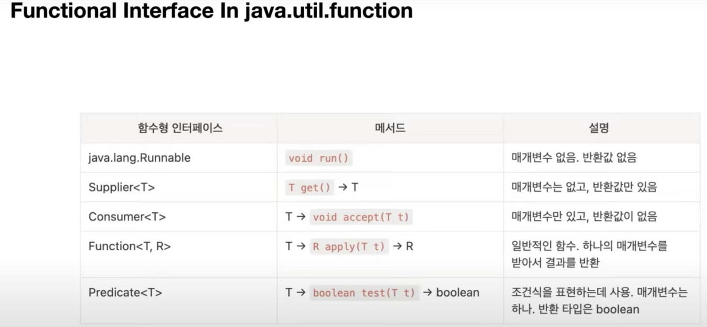

# 04. Java HTTP Server

### 목차
* Java HTTP Server
* Java NIO
* Java Lambda expression(람다식)
    - Java Functional interface(함수형 인터페이스)


**Java HTTP Server and NIO** <br>
고수준의 서버 API a sample high-level HTTP Server API
TLS 및 내부적으로 NIO를 사용함으로써 더 효율적이다.

1. 서버 객체 준비
   ```
   InetSocketAddress address = new InetSocketAddress(8080);
   int backlog = 0;
   HttpServer httpServer = HttpServer.create(address, backlog);```
2. URL(path) 에 핸들러 지정

    `httpServer.createContext("/", (exchange) -> {
// TODO
});`

3. Listen

    `httpServer.start();`

4. Request

    ``` 
    String method = exchange.getRequestMethod();
    System.out.println(method);

    URI uri = exchange.getRequestURI();
    String path = uri.getPath();
    System.out.println(pa System.out.println(key + ": " + headers.get(key));th);
    
    Headers headers = exchange.getRequestHeaders();
    for (String key : headers.keySet()) {
   
    }
    
    InputStream inputStream = exchange.getRequestBody();
    String body = new String(inputStream.readAllBytes());
    System.out.println(body);
    ```
5. Response
    ```
   String body = "Hello, world!";
    byte[] bytes = body.getBytes();
    exchange.sendResponseHeaders(200, bytes.length);
    OutputStream outputStream = exchange.getResponseBody();
    outputStream.write(bytes);
    outputStream.flush();

**Java Lambda expression(람다식)** <br>
interface에 abstract 메서드가 하나인 인터페이스는 함수형 인터페이스이다.
파라미터를 받아

`httpServer.createContext("/", (exchange) -> {
 1. request
 2. response 작성
});`

- Functional Interface: 단 하나의 추상 메서드만 선언된 인터페이스 (람다식을 다루기 위한 인터페이스)



**Java 8 의 주요 변경 사항**
- 자바8의 주요 변경 사항 : Lambda Expression, Functional Interface, Default Method, Stream, Optional
- Lambda Expression : 메서드를 하나의 식으로 표현한 것

### 궁금한 점?
1. 모듈 패키지 라이브러리 프레임워크 차이 <br>
=> 정확한 정의가 무엇인지 확인필요
2. 자세한 Java Functional interface <br>
=> 모던 자바 인 액션 공부 필요

