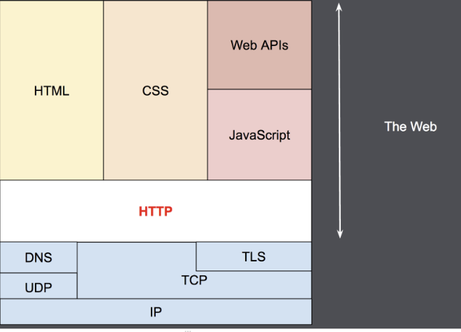
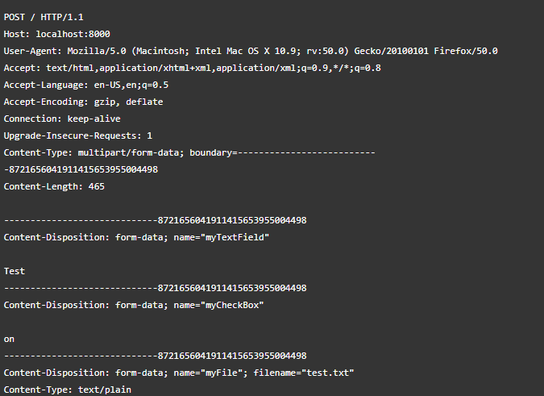

# 01. HTTP의 이해

### 목차

* HTTP(Hypertext Transfer Protocol)
* HTTP와 HTTPS의 차이(TLS)
* 클라이언트-서버 모델
* stateless와 stateful
* HTTP Cookie와 HTTP Session
* HTTP 메시지 구조
  * HTTP 요청(Request)와 응답(Response)
    * multipart/form-data
  * HTTP 요청 메서드(HTTP request methods)
    * 멱등성
  * HTTP 응답 상태 코드(HTTP response status code)
    * 리다이렉션

### 강의 정리

\*\*HTTP(Hyper Text Transfer Protocol)\*\*는 하이퍼미디어 문서를 전송하기 위한 Application Layer 프로토콜 (약속) 이다. 또한 웹에서 이루어지는 모든 데이터 교환의 기초이며, 클라이언트-서버 프로토콜이다.\

* Internet Protocol suite

 (1) (1) (1) (1).png>)

***

**HTTPS**는 클라이언트와 서버간의 모든 커뮤니케이션을 암호화 하기 위해 사용된다. **Transport Layer Security(TLS)** 는 어플리케이션들이 네트워크 상에서 안전하게 통신하기 위해 사용되는 프로토콜로 정보의 변형을 방지한다.

***

\*\*클라이언트-서버 모델\*\*은 서비스의 제공자와 요청자 사이에 작업 또는 워크로드를 분할하는 분산 응용 프로그램 구조이다.\
클라이언트-서버 프로토콜이란 보통 웹브라우저인 수신자 측에 의해 요청이 초기화되는 프로토콜을 의미한다. ex) HTTP\
개별적인 메세지 교환에 의해 통신하며 클라이언트에 의해 전송되는 메세지를 Requests, 서버에서 응답으로 전송되는 메세지를 Response 라고 한다.

***

\*\*stateless와 HTTP Cookie, Session\*\* HTTP는 stateless하다. (기본적으로 상태를 저장하지 않는다.)\
HTTP 쿠키는 서버가 사용자의 웹 브라우저에 전송하는 작은 데이터 조각\
웹 브라우저는 그 데이터 조각들을 저장해 놓았다가, 동일한 서버에 재 요청 시 저장된 데이터 조각을 함께 전송한다.\
이를 이용해 상태가 없는(stateless) HTTP 프로토콜에서 상태 정보를 기억시켜준다.

**Session**이란? 서버가 해당 서버(웹)로 접근(request)한 클라이언트(사용자)를 식별하는 방법 서버는 접근한 클라이언트(사용자)에게 response-header field인 set-cookie 값으로 클라이언트 식별자인 session-id를 응답한다. 서버로부터 응답된 session-id는 해당 서버와 클라이언트(웹 브라우저) 메모리에 저장된다.

이때 클라이언트 메모리에 사용되는 cookie 타입은 세션 종료 시 같이 소멸되는 "Memory cookie"가 사용된다.

**Cookie 의 종류**

1. persistent cookie 만료일을 지정하여 사용하는 쿠키이다.
2. session cookie 만료일이 존재하지 않지만 브라우저 혹은 탭이 열려있는 경우에만 데이터를 저장한다.

**Storage의 종류**

1. localStorage 만료일이 존재하지 않으며 사용자가 임의적으로 삭제하지 않는 다면 해당 브라우저에 영구적으로 보존되고 새로운 탭으로 접근하거나 껐다 켜도 데이터가 사라지지 않는다.
2. sessionStorage session cookie와 마찬가지로 저장한 브라우저가 열렸을 경우에만 저장되며, 만약 브라우저의 탭을 닫을 경우 해당 데이터는 소멸합니다. 새로운 탭으로 접근해도 기존의 데이터를 못가져옵니다.

Cookie vs Storage 작성중..

***

**HTTP1.1 VS HTTP2**

 HTTP 1.1의 단점\
본문은 압축이 되지만 헤더는 압축이 되지 않습니다. 연속된 메시지들은 비슷한 헤더 구조를 띄기 마련인데, 그럼에도 불구하고 메시지마다 반복되어 전송되고 있습니다. 다중전송(multiplexing)이 불가능합니다. 서버 하나에 연결을 여러개 열어야 합니다.

HOL Blocking(Head of Line Blocking) 문제 : 같은 큐에 있는 패킷이 첫번 째 패킷에 의해 지연 될때 성능 저하

HTTP2에서는 지연 시간을 줄이고 응답시간을 높이기 위해 멀티플렉싱, 헤더압축, 서버 푸시, 요청의 우선 순위 처리를 지원한다.

* 멀티플렉싱 : 여러개의 스트림을 사용하여 송수신함으로써 특정 스트림의 패킷이 손실되더라도 해당 스트림에만 영향이 간다. 또한 단일 연결을 사용해 병렬로 여러 요청을 주거나 받아 HOL Blocking 문제가 해결된다.\

* 서버푸시 : 클라이언트의 요청 없이 서버가 바로 리소스를 푸시 가능하다. html -> css -> js 전송 html을 읽으면서 css를 서버에서 푸시하여 클라이언트에게 바로 줄 수 있다.

**HTTP 메시지**는 서버와 클라이언트 간에 데이터가 교환되는 방식이다. request는 클라이언트가 서버로 전달해서 서버의 액션이 일어나게끔 하는 메시지고 response는 response에 대한 서버의 답변이다.

아래 처럼 클라이언트 -> 서버 요청에는\
HTTP Method / 타켓 URL / HTTP 버전 + HTTP Header + Body(생략가능)로 구성된다. Body는 보통 서버의 데이터 업데이트 요청시 사용된다.\

**multipart/form-data**은 브라우저에서 서버로 HTML Form의 내용을 전송 시 사용할 수 있다. **각 파트는 그 자체로 개체이며 자신만의 HTTP 헤더를 가지는데, 파일 업로드 필드를 위한 헤더로는 Content-Disposition을 사용한다.**

&#x20;

**HTTP 메서드에 따른 멱등성과 안전성 정리**

&#x20;

**HTTP 상태 코드 정리**

1. 응답 성공

* 200 OK 요청이 성공적으로 되었습니다. 성공의 의미는 HTTP 메소드에 따라 달라집니다: GET: 리소스를 불러와서 메시지 바디에 전송되었습니다. HEAD: 개체 해더가 메시지 바디에 있습니다. PUT 또는 POST: 수행 결과에 대한 리소스가 메시지 바디에 전송되었습니다. TRACE: 메시지 바디는 서버에서 수신한 요청 메시지를 포함하고 있습니다.
* 201 Created 요청이 성공적이었으며 그 결과로 새로운 리소스가 생성되었습니다. 이 응답은 일반적으로 POST 요청 또는 일부 PUT 요청 이후에 따라옵니다.
* 202 Accepted 요청을 수신하였지만 그에 응하여 행동할 수 없습니다. 이 응답은 요청 처리에 대한 결과를 이후에 HTTP로 비동기 응답을 보내는 것에 대해서 명확하게 명시하지 않습니다.
* 204 No Content 요청에 대해서 보내줄 수 있는 콘텐츠가 없지만, 헤더는 의미있을 수 있습니다. 사용자-에이전트는 리소스가 캐시된 헤더를 새로운 것으로 업데이트 할 수 있습니다.

2. 리다이렉트

* 302 Found 이 응답 코드는 요청한 리소스의 URI가 일시적으로 변경되었음을 의미합니다. 새롭게 변경된 URI는 나중에 만들어질 수 있습니다. 그러므로, 클라이언트는 향후의 요청도 반드시 동일한 URI로 해야합니다. 다른 HTTP 메서드로 사용 가능하다.
* 304 Not Modified 캐시 되어 있는 값 가져올 때는 304 이것은 클라이언트에게 응답이 수정되지 않았음을 알려주며, 그러므로 클라이언트는 계속해서 응답의 캐시된 버전을 사용할 수 있습니다.
* 307 Temporary Redirect 클라리언트가 요청한 리소스가 다른 URI에 있으며, 이전 요청과 동일한 메소드를 사용하여 요청해야할 때, 서버가 클라이언트에 이 응답을 직접 보냅니다. 이것은 302 Found HTTP 응답 코드와 동일한 의미를 가지고 있지만 동일한 HTTP 메소드를 사용해야 한다는 규칙이 있다.

3. 요청 실패

* 400 Bad Request 이 응답은 잘못된 문법으로 인하여 서버가 요청을 이해할 수 없음을 의미합니다.
* 401 Unauthorized 이 응답은 "비인증(unauthenticated)"을 의미합니다. 클라이언트는 요청한 응답을 받기 위해서는 반드시 스스로를 인증해야 합니다.
* 403 Forbidden 클라이언트는 콘텐츠에 접근할 권리를 가지고 있지 않습니다.401과 다른 점은 서버가 클라이언트가 누구인지 알고 있습니다.
* 404 Not Found 서버는 요청받은 리소스를 찾을 수 없습니다. 브라우저에서는 알려지지 않은 URL을 의미합니다.
* 405 Method Not Allowed 요청한 메소드는 서버에서 알고 있지만, 제거되었고 사용할 수 없습니다.
* 412 Precondition Failed (en-US) 클라이언트의 헤더에 있는 전제조건은 서버의 전제조건에 적절하지 않습니다.
* 415 Unsupported Media Type 요청한 미디어 포맷은 서버에서 지원하지 않습니다.

4. 서버 오류

* 500 Internal Server Error 서버가 처리 방법을 모르는 상황이 발생했습니다.
* 502 Bad Gateway 이 오류 응답은 서버가 요청을 처리하는 데 필요한 응답을 얻기 위해 게이트웨이로 작업하는 동안 잘못된 응답을 수신했음을 의미합니다.
* 503 Service Unavailable 서버가 요청을 처리할 준비가 되지 않았습니다. 일반적인 원인은 유지보수를 위해 작동이 중단되거나 과부하가 걸렸을 때 입니다.
* 504 Gateway Timeout 이 오류 응답은 서버가 게이트웨이 역할을 하고 있으며 적시에 응답을 받을 수 없을 때 주어집니다.

***

### 궁금한 점?

1. 네트워크 흐름의 계층을 나누는 이유가 무엇일까?\
   \=> 통신이 일어나는 과정을 단계 별로 파악할 수 있으므로 네트워크에서의 문제 발생 시 파악이 용이해진다.
2. HTTPS를 구축하면 Transport Layer (TCP/UDP) -> TLS or SSL -> Application Layer 로 흐름을 이해하면 될까요?\
   \=> ??
3. HTTP의 stateless 장단점?\
   \=> 장점 : 서버의 스케일 업/다운이 쉽다, 서버의 리 => 단점 : 소켓 close() 를 하지 않고 계속 연결 시키면 다른 사용자가 들어오지 못해 서버의 자원을 비효율적으로 이용하게 된다(?) 대신 stateless는 다시 TCP HandShake에 필요한 오버헤드가 있는 것 같다.
4. HTTP3는 그러면 왜 UDP(QUIC)를 사용했을까?\
   \=> ?? 자료조사중,,
5. HTTP 메서드의 멱등성을 알아야하는 이유가 무엇일까?\
   \=> GET,HEAD,OPTIONS,DELETE,TRACE 같은 경우에는 요청에 실패한 경우 바로 재요청으로 문제를 해결할 수 있지만 그외 메서드들은 서버의 상태가 변경될 수 있으므로 서버에서 멱등성을 추가해주어 안전한 API를 만들 수 있다.\
   멱등키,트랜잭션 롤백\
   https://docs.tosspayments.com/guides/using-api/idempotency-key?utm\_source=tosspayments\&utm\_medium=velog
6. HTTP는 클라이언트-서버 모델인데 XMLHTTPREQUEST 나 HTTP2의 서버푸시는 요청-응답 구조 안에서 작동하는건가?\
   \=> 작성중,,
