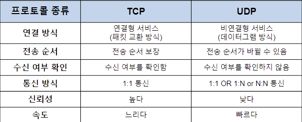
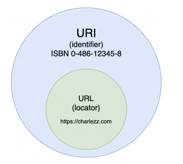
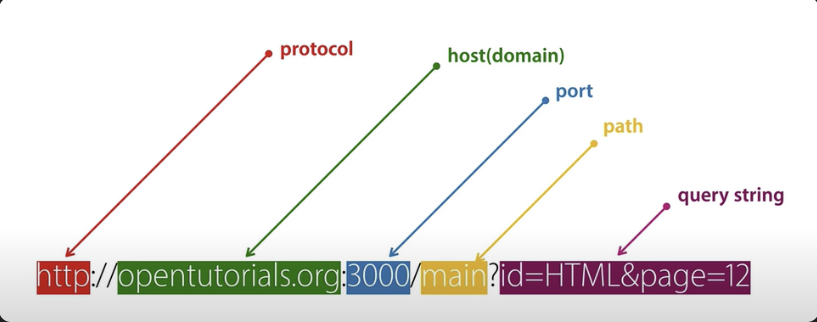
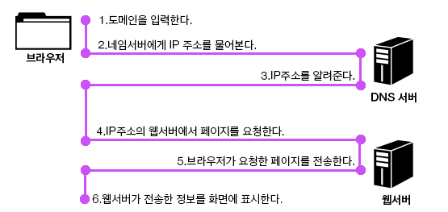
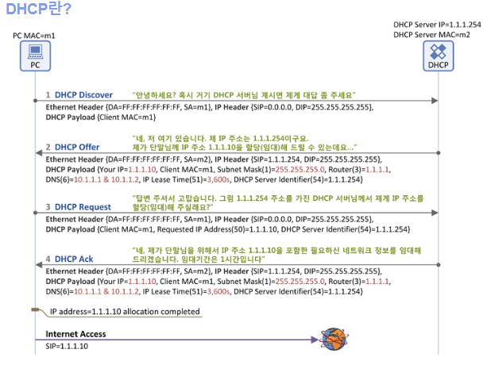
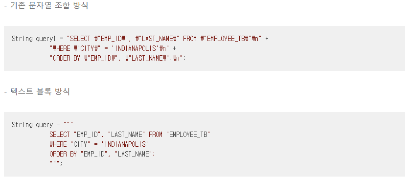

# 02. HTTP Client

### 목차

* TCP/IP 통신
* TCP와 UDP
* Socket과 Socket API 구분
* URI와 URL
* 호스트(host)
    * IP 주소
    * Domain name
    * DNS
* 포트(port)
* path(경로)
* Java text blocks
* Java InputStream과 OutputStream
* Java try-with-resources

### 강의 정리
HTTP 클라이언트에서 기본적으로 **IP와 포트번호**를 보고 서버와 연결 할 수 있다.

전송 계층의 대표적인 프로토콜

- **TCP**: 연결이 필요함. 전달 및 순서 보장.
- **UDP**: 연결하지 않고 데이터를 보냄. 전달 및 순서를 보장하지 않음.

**[ TCP 특징 ]**  
연결 지향 방식으로 패킷 교환 방식을 사용한다(가상 회선 방식이 아님).
3-way handshaking과정을 통해 연결을 설정하고 4-way handshaking을 통해 해제한다.
흐름 제어 및 혼잡 제어.
높은 신뢰성을 보장한다.
UDP보다 속도가 느리다.
전이중(Full-Duplex), 점대점(Point to Point) 방식.

**[ TCP 서버의 특징 ]**  
서버소켓은 연결만을 담당한다.
연결과정에서 반환된 클라이언트 소켓은 데이터의 송수신에 사용된다
서버와 클라이언트는 1대1로 연결된다.
스트림 전송으로 전송 데이터의 크기가 무제한이다.
패킷에 대한 응답을 해야하기 때문에(시간 지연, CPU 소모) 성능이 낮다.
Streaming 서비스에 불리하다.(손실된 경우 재전송 요청을 하므로)

**[ UDP 특징 ]**  
비연결형 서비스로 데이터그램 방식을 제공한다
정보를 주고 받을 때 정보를 보내거나 받는다는 신호절차를 거치지 않는다.
UDP헤더의 CheckSum 필드를 통해 최소한의 오류만 검출한다.
신뢰성이 낮다
TCP보다 속도가 빠르다

**[ UDP 서버의 특징** ]  
UDP에는 연결 자체가 없어서(connect 함수 불필요) 서버 소켓과 클라이언트 소켓의 구분이 없다.
소켓 대신 IP를 기반으로 데이터를 전송한다.
서버와 클라이언트는 1대1, 1대N, N대M 등으로 연결될 수 있다.
데이터그램(메세지) 단위로 전송되며 그 크기는 65535바이트로, 크기가 초과하면 잘라서 보낸다.
흐름제어(flow control)가 없어서 패킷이 제대로 전송되었는지, 오류가 없는지 확인할 수 없다.
파일 전송과 같은 신뢰성이 필요한 서비스보다 성능이 중요시 되는 경우에 사용된다.

**소켓 프로그래밍 API (버클리소켓) VS 네트워크 소켓**  

네트워크 소켓은 프로세스 간 통신의 엔드포인트 이다.
통신을 위해서 프로그램들은 소켓을 생성하고 이 소켓을 통해 서로 데이터를 교환하게 된다.
소켓 API는 키보드,화면,파일처럼 Stream으로 다룰 수 있다.

**URL과 URI**  

URI는 인터넷상의 리소스 “자원 자체”를 식별하는 고유한 문자열 시퀀스

!

**URI**
URI는 특정 리소스를 식별하는 통합 자원 식별자(Uniform Resource Identifier)를 의미한다. 웹 기술에서 사용하는 논리적 또는 물리적 리소스를 식별하는 고유한 문자열 시퀀스다.

**URL**
URL은 흔히 웹 주소라고도 하며, 컴퓨터 네트워크 상에서 리소스가 어디 있는지 알려주기 위한 규약이다. URI의 서브셋이다.

비록 URL은 URI의 서브셋이지만 URI와 URL의 가장 큰 차이점은 URI는 식별하고, URL은 위치를 가르킨다.

**Host, Port,Path**  
URL의 구조는 아래와 같다.

**DNS**  
DNS (Domain Name System)는 인터넷에 연결된 리소스에 대한 계층적이고 분산된 이름 지정 시스템입니다. 
DNS는 도메인 이름 목록 과 그에 연결된 IP 주소 등의 리소스를 유지 관리합니다.  
글로벌하게 서버를 운영하는 경우에는 DNS를 통한 로드밸런싱 트래픽 분산이 가능하다.

**DHCP**  

DHCP는 Dynamic Host Configuration Protocol의 약자로서 PC에 자동으로 네임 서버 주소, IP 주소, 게이트웨이 주소 등을 할당해주는 프로토콜을 의미한다.
즉, 우리가 컴퓨터를 켜면 나타나는 IP 주소는 보통 동적 IP로써 이러한 IP를 DHCP에서 주는 것이라고 생각하면 된다.

DHCP Discover : PC에서 DHCP서버가 있는지 브로드캐스팅 방식을 통해 DHCP Discover 메시지를 보내게 된다.  
DHCP Offer : DHCP에서 PC에게 줄 수 있는 IP주소 리스트를 제공해준다.  
DHCP Request : 리스트중 IP 하나를 선택하여 제공을 요청한다.  
DHCP Ack : IP 및 네트워크 정보를 할당해주고 임대 기간을 알려준다.

+ 장점 : IP를 자동으로 할당해주기 때문에 IP 충돌을 사전에 방지 할 수 있다.
+ 단점 : DHCP서버에 의존하여 IP 주소를 할당받으므로 DHCP 서버가 다운되면 IP를 받지 못하여 인터넷 사용이 불가능 할 수 있다.

Java  
**Text Block**

텍스트 블록은 멀티 라인의 문자열을 에스케이프 시퀀스 없이 사용함으로 코드의 가독성을 높이는데 주된 목적을 가지고 있다. 
하지만, String 클래스 (혹은 객체)와 문자열 조합을 위한 '+' 연산을 대체하는 것은 아니다.

아래 처럼 변수를 넣을 수 있다.

pubilc static void test () {  

    String type1 = """  
        hello #1 #2  
    """.replace("#1", "world").replace("#2", "!!");  //replace메소드  
    System.out.println(type1);  

    String type2 = """  
        hello %s %s  
    """.formatted("world", "!!");  //formatted메소드  
    System.out.println(type2);  
}

**Java의 Stream** 
자바의 데이터는 스트림을 통해서 입출력된다.
스트림은 데이터의 출발지에서 도착지로 단일 방향으로 흘러가는 개념을 의미한다.
바이트 기반 스트림 VS 문자 기반 스트림

최상위 바이트 기반 스트림 클래스, InputStream과 OutputStream
InputStream 은 바이트 기반 입력 스트림 최상위 추상 클래스이고, OutputStream 은 바이트 기반 출력 스트림 최상위 추상 클래스이다. 이들의 하위 클래스는 XXXInputStream , XXXOutputStream 이라는 네이밍을 가진다.

최상위 문자 기반 스트림 클래스, Reader와 Writer
Reader 는 문자 기반 입력 스트림 최상위 추상 클래스이고, Writer 는 문자 기반 출력 스트림 최상위 추상 클래스이다. 이들의 하위 클래스는 XXXReader , XXXWriter 이라는 네이밍을 가진다. 이를테면, FileReader 가 있다.

+ Buffer를 이용해 중간에 버퍼로 보내 데이터를 한번에 하드디스크로 보내 출력 횟수를 줄일 수 있다. 
 
스트림은 꼭 사용이 끝나면 close() 메소드로 스트림을 닫아 자원을 해제해야한다. 
이는 try with resources 문법으로 간략하게 실행할수도 있다.
꼭 회수해야 하는 자원을 다룰 때는 try-with-resources를 사용하자. 코드는 더 짧고 분명해지고, 
만들어지는 예외 정보도 훨씬 유용하고 쉽게 자원을 회수 할 수 있다.

### 궁금한 점?
1. www.naver.com을 주소창에 입력하면 어떤일이 일어날까? (정리필요)  k
=> https://www.youtube.com/watch?v=YahjHM9UNCA