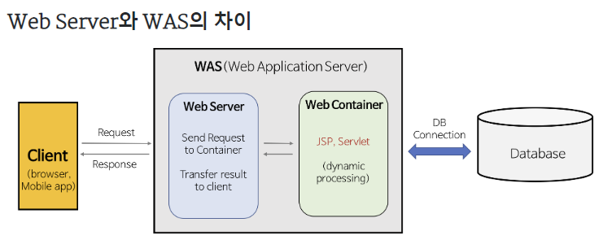

# 05. Spring Web MVC

### 목차
* [Spring](https://docs.spring.io/spring-framework/docs/current/reference/html/overview.html#overview)(링크된 문서에서 핵심을 캐치할 것, 괴롭지만 한 번은 해내야 함)
* Spring Boot
* Spring initializer
*Web Server와 Web Application Server(WAS)
  * Tomcat
* Model-View-Controller(MVC) 아키텍처 패턴
* 관심사의 분리(Seperation of Concern)
* Spring MVC
* Java Annotation
* Spring Annotation
    - @RestController
        - @Controller
        - @ResponseBody
    - @GetMapping
        - @RequestMapping

#### **Spring**  

Spring을 사용하면 Java 엔터프라이즈 애플리케이션을 쉽게 만들 수 있습니다. 이는 JVM의 대체 언어로 Groovy 및 Kotlin을 지원하고 애플리케이션의 요구 사항에 따라 다양한 종류의 아키텍처를 생성할 수 있는 유연성을 통해 엔터프라이즈 환경에서 Java 언어를 수용하는 데 필요한 모든 것을 제공합니다.

**핵심기술**  
가장 중요한 것은 Spring Framework의 IoC(Inversion of Control) 컨테이너입니다. Spring Framework의 IoC 컨테이너에 대한 철저한 처리 뒤에는 Spring의 AOP(Aspect-Oriented 프로그래밍) 
기술에 대한 포괄적인 내용이 밀접하게 이어집니다. Spring Framework에는 개념적으로 이해하기 쉽고 자체 AOP 프레임워크가 있습니다.

**테스트**  
Spring 팀은 테스트 중심 개발(TDD)을 옹호합니다. 제어 반전(IoC)의 올바른 사용이 확실히 단위 테스트와 통합 테스트를 더 쉽게 만든다는 것을 발견했습니다.

**스프링 부트**  
Spring Boot는 실행할 수 있는 독립 실행형 프로덕션 등급으로 최소한의 수정으로 시작할 수 있습니다.

**웹 서버와 WAS**
웹 서버는 HTTP 기반에서 클라이언트의 요청을 서비스하는 기능을 담당한다.
1. 정적 컨텐츠 제공 (WAS를 거치지 않는다)
2. 동적인 컨텐츠 제공을 위한 요청 전달 (클라이언트와 WAS 사이의 중간 역할) ex) Nginx , Apache
웹 어플리케이션 서버(WAS)는 DB 조회나 다양한 로직 처리를 요구하는 동적 컨텐츠를 제공하기 위해 만들어진 어플리케이션 서버다.
WAS = Web Server + Web Container 이다
1. 비즈니스 로직 수행 및 트랜잭션 관리
2. DB 접속

### 궁금한 점? (작성중)
1. Spring vs Spring Boot
2. IoC AOP DI POJO 개념
3. 실무에서는 거의 NGINX를 사용하는데 WAS와 웹 서버 분리 이유? 미들웨어와 웹서버 차이?