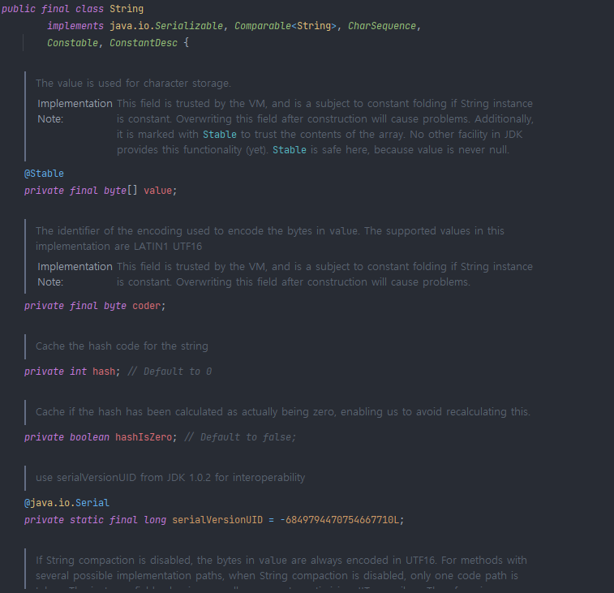

# 01.REST API

### 목차
- API(Application Programming Interface)
- 정보은닉(Information Hiding)과 캡슐화(Encapsulation)
     - 그리고 이 둘의 차이
- Architecture와 Architecture Style의 차이
- REST(7가지 제약 조건 위주로 정리)
### 강의 정리

* API(Application Programming Interface)  
**API**는 소프트웨어 프로그램(애플리케이션) 내부에 존재하는 기능 및 규칙의 집합입니다. 
즉, API를 제공하는 애플리케이션과 다른 서드파티 소프트웨어 및 하드웨어 등의 것들 사이의 간단한 인터페이스 라고도 볼 수 있습니다.  
서로 다른 어플리케이션이 통신하는 방법을 API를 통해 정의합니다.

* 정보은닉(Information Hiding)과 캡슐화(Encapsulation)
  + 정보은닉  
정보 은닉은 무언가 정보를 은닉하여 보안적인 효과 + 은닉되어 알필요가 없어 덜 알아도 되어 간편하게 사용할 수 있게 해주는 의미도 내포한다.  
ex) 우리가 자동차를 몰때 엔진이 어떻게 구동되어 바퀴가 굴러가는지 지식 필요없이 페달만 밟으면 자동차가 굴러간다.

이것이 자동차 원리 설계 정보를 은닉함으로서 경쟁사로부터 제품내부를 알지못하게 보안하는 효과도 있지만 소비자가 페달만 밟으면 작동하도록 단순화 한것도 포함한다.
  + 캡슐화   캡슐화는 변수나 메소드를 감싸서 안보이게 하는 정보 은닉의 일부이다. 
  이를 통해 외부로부터의 접근을 제한하여 의도치 않은 동작을 통한 값 변경을 방지한다.

  + 둘의 차이점? 캡슐화를 통해 정보 은닉을 가능하며 이외에도 디자인패턴(팩토리 패턴),업캐스팅을 통해 정보은닉이 가능하다.

* Architecture와 Architecture Style의 차이
  + Architecture 
  + Architecture Style
  
아키텍쳐는 시스템이나 소프트웨어의 고수준의 구조를 의미합니다.
주요 시스템 구성 요소, 이들 구성 요소 간의 관계, 그리고 이들 구성 요소가 상호 작용하는 방법을 설명합니다.

아키텍처 스타일은  아키텍처가 지켜야하는 제약조건들의 집합이다.
예를 들어, '레이어드 (Layered)', '이벤트 주도 (Event-Driven)', '마이크로서비스 (Microservices)', '파이프-필터 (Pipe-and-Filter)' 등의 아키텍처 스타일이 있습니다.
간단히 말해, 아키텍처는 '무엇'과 '어떻게'에 관한 것이며, 아키텍처 스타일은 그러한 아키텍처를 구축하기 위한 '방법론'이나 '패턴'을 의미합니다.

* REST(7가지 제약 조건 위주로 정리)  
로이필딩의 REST 아키텍쳐  

1️⃣ **Starting with the Null Style**  
아무런 제약이 없는 기본 구조 (네트워크에서 모든 가능성을 표현 가능)
2️⃣**Client-Server**  
클라이언트와 서버로 분리하여 독립적으로 발전
3️⃣**Stateless**  
서버는 클라이언트의 상태를 저장하지 않아 독립적으로 확장할 수 있다.
4️⃣**Cache**  
클라이언트나 중간 레이어에서 서버의 응답을 캐싱할 수 있어야 성능이 향상되고 서버 부하를 줄인다.
5️⃣**Uniform Interface → 핵심!**  
아래의 일관된 인터페이스를 통해 컴포넌트 간의 상호작용을 단순화하고 시스템을 모듈화 한다.
1. Identification of Resources
   리소스는 URI(Uniform Resource Identifier)를 통해 명확하게 식별되어야 합니다. 이를 통해, 리소스를 조작하는 데 필요한 정보는 모두 URI에 담겨 있습니다.
2. Manipulation of Resources Through Representations
   클라이언트는 리소스의 표현(representation, 예: JSON, XML 등)을 가지고 리소스를 조작합니다. 즉, 리소스 자체가 아니라 그 "표현"을 사용하여 CRUD(Create, Read, Update, Delete) 연산을 수행합니다.

3. Self-descriptive Messages
   메시지는 자기 기술적(self-descriptive)이어야 합니다. 이는 HTTP 메서드(GET, POST, PUT, DELETE 등)와 미디어 타입, 상태 코드 등을 사용하여 메시지 자체가 어떤 연산을 수행해야 하는지 명확하게 해야 함을 의미합니다.

4. Stateless
   각 요청은 모든 필요한 정보를 가지고 있어야 하며, 서버는 클라이언트의 상태 정보를 저장해서는 안 됩니다. 이를 통해 서비스가 확장성을 가질 수 있습니다.

5. HATEOAS (Hypermedia as the Engine of Application State)
   클라이언트는 서버에서 제공하는 하이퍼미디어 링크를 통해 가능한 작업을 알 수 있어야 합니다. 즉, 리소스의 상태를 조작할 수 있는 연산은 리소스의 표현 내에서 동적으로 발견될 수 있어야 합니다.

6️⃣**Layered System**  
아키텍쳐가 여러 계층으로 구성되어 오직 인접한 계층에만 의존할 수 있도록 만들 수 있다.  
7️⃣**Code-On-Demand**  
클라이언트가 필요에 따라 코드를 서버로부터 다운로드하여 실행하여 클라이언트가 독립적으로 기능을 확장할 수 있게 한다.  
 
**REST의 목적은 결국 서비스를 단순하게 만들고 서버와 클라이언트가 독립적으로 발전하고 확장될 수 있도록 한다.**  
로이 필딩은 필딩 제약 조건을 지키지 않는 API를 REST API라고 부르는 것에 반대하지만 리처드슨 성숙도 모델의 레벨 2만 만족해도 REST API라고 부르면 된다.
***

### 궁금한 점?

1. API를 한마디로 표현하면?  
=> 서로 다른 어플리케이션의 통신을 위해 API를 통해 약속하는 것이다. 
2. String 자료형의 캡슐화  
=> String 클래스의 내부 필드는 private 제어자로 선언되어 있어 직접적으로 문자열 값에 접근하여 변경할 수 없다. 
String 값은 불변의 데이터라고 불리는 이유는 바로 캡슐화 덕분이다. 
공개 메서드와 은닉 메서드를 구분하고 공개 메소드의 갯수를 최소화 시키는 이유가 구현 은닉을 위한 설계이며 자바에서 인터페이스 라는 것을 사용하는 이유다.

3. 그런 REST API로 괜찮은가? NAVER D2의 REST API에 대한 자세한 강의  
=> https://www.youtube.com/watch?v=RP_f5dMoHFc