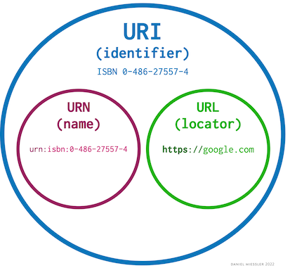

# 02.URI & MIME type

### 목차

* URI & URL & URN
 + URI : Uniform Resource Identifier
통합 자원 식별자로 컴퓨터 네트워크에 있는 자원을 나타내는 유일한 주소이다.
 + URL : Uniform Resource Locator 
프로토콜을 포함하여 네트워크 상의 자원의 경로를 알려주기 위한 규약이며 컴퓨터 네트워크 상의 자원을 모두 나타낼 수 있다.
 + URN : Uniform Resource Name
프로토콜을 포함하지 않은 해당 자원의 유일하고 영속적인 의미를 말한다.

* MIME  
  **MIME 타입(contents-header)**이란 클라이언트에게 전송된 문서의 다양성을 알려주기 위한 메커니즘이다.
웹에서 파일의 확장자는 별 의미가 없어 각 문서와 함께 올바른 MIME 타입을 전송하도록, 서버가 정확히 설정하는 것이 중요하다. 브라우저들은 리소스를 내려받았을 때 해야 할 기본 동작이 무엇인지를 결정하기 위해 MIME 타입을 사용한다.
***
* MIME type의 종류  
확장자	문서 종류	MIME 타입  
.aac	AAC 오디오 파일	audio/aac  
.arc	아카이브 문서 (인코딩된 다중 파일)	application/octet-stream  
.avi	AVI: Audio Video Interleave	video/x-msvideo  
.azw	아마존 킨들 전자책 포맷	application/vnd.amazon.ebook  
.bin	모든 종류의 이진 데이터	application/octet-stream  
.bz	BZip 아카이브	application/x-bzip  
.bz2	BZip2 아카이브	application/x-bzip2  
.csh	C-Shell 스크립트	application/x-csh  
.css	Cascading Style Sheets (CSS)	text/css  
.csv	Comma-separated values (CSV)	text/csv  
.doc	Microsoft Word	application/msword  
.epub	Electronic publication (EPUB)	application/epub+zip  
.gif	Graphics Interchange Format (GIF)	image/gif  
.htm .html	HyperText Markup Language (HTML)	text/html  
.ico	Icon 포맷	image/x-icon  
.ics	iCalendar 포맷	text/calendar  
.jar	Java 아카이브 (JAR)	application/java-archive  
.jpeg .jpg	JPEG 이미지	image/jpeg  
.js	JavaScript (ECMAScript)	text/javascript (Specifications: HTML and RFC 9239)  
.json	JSON 포맷	application/json  
.mid .midi	Musical Instrument Digital Interface (MIDI)	audio/midi  
.mpeg	MPEG 비디오	video/mpeg  
.mpkg	Apple Installer Package	application/vnd.apple.installer+xml  
.odp	OpenDocuemnt 프리젠테이션 문서	application/vnd.oasis.opendocument.presentation  
.ods	OpenDocuemnt 스프레드시트 문서	application/vnd.oasis.opendocument.spreadsheet  
.odt	OpenDocument 텍스트 문서	application/vnd.oasis.opendocument.text  
.oga	OGG 오디오	audio/ogg  
.ogv	OGG 비디오	video/ogg  
.ogx	OGG	application/ogg  
.pdf	Adobe Portable Document Format (PDF)	application/pdf  
.ppt	Microsoft PowerPoint	application/vnd.ms-powerpoint  
.rar	RAR 아카이브	application/x-rar-compressed  
.rtf	Rich Text Format (RTF)	application/rtf  
.sh	Bourne 쉘 스크립트	application/x-sh  
.svg	Scalable Vector Graphics (SVG)	image/svg+xml  
.swf	Small web format (SWF) 혹은 Adobe Flash document	application/x-shockwave-flash  
.tar	Tape Archive (TAR)	application/x-tar  
.tif .tiff	Tagged Image File Format (TIFF)	image/tiff  
.ttf	TrueType Font	application/x-font-ttf  
.wav	Waveform Audio Format	audio/x-wav  
.xhtml	XHTML	application/xhtml+xml  
.xls	Microsoft Excel	application/vnd.ms-excel  
.xml	XML	application/xml  
.zip	ZIP archive	application/zip  
.7z	7-zip 아카이브	application/x-7z-compressed  

### 궁금한 점?
1. 이미지(파일) 업로드, 다운로드시에 MIME 타입? Base64 인코딩하여 application/octet-stream VS multipart/form

**Base64 인코딩하여 application/octet-stream 사용**   
장점:   
단순성: Base64 인코딩된 문자열은 JSON 객체에 쉽게 포함될 수 있으므로, 다른 메타데이터와 함께 전송하기가 쉽습니다.   
텍스트 기반: 모든 데이터가 텍스트 형식이므로, 이진 데이터가 허용되지 않는 환경에서 유용할 수 있습니다.   
단점:  
효율성: Base64 인코딩은 원래 파일 크기에 비해 약 33% 정도 크기가 증가합니다.(바이너리 데이터 -> 아스키문자열 3바이트 블록을 4개의 아스키 문자로 변환)  
대용량 파일이나 많은 수의 파일을 처리할 때 비효율적일 수 있습니다.  
 
**multipart/form-data 사용**   
장점:  
효율성: 이 방식은 파일을 그대로 전송하기 때문에, Base64 인코딩과는 달리 추가적인 데이터 크기 증가가 없습니다.  
표준화: 이는 파일 업로드의 웹 표준입니다, 따라서 대부분의 서버와 클라이언트는 이 방식을 지원합니다.  
단점:  
복잡성: multipart/form-data는 경계 문자열(boundary string)을 사용하여 파트를 구분하므로, 이를 파싱해야 합니다. 대부분의 웹 프레임워크가 이를 자동으로 처리해 주지만, 복잡한 상황에서는 수동으로 처리해야 할 필요가 있을 수도 있습니다.  
결론:  
효율성이 중요한 경우: 대용량 파일을 다룰 때는 multipart/form-data가 더 적합할 수 있습니다.  
메타데이터와 함께 전송해야 하는 경우: 작은 이미지나 다른 작은 파일들이 JSON 객체와 함께 전송되어야 한다면, Base64 인코딩이 더 편리할 수 있습니다.
따라서 사용 사례에 따라 적절한 방법을 선택하는 것이 중요합니다.  

