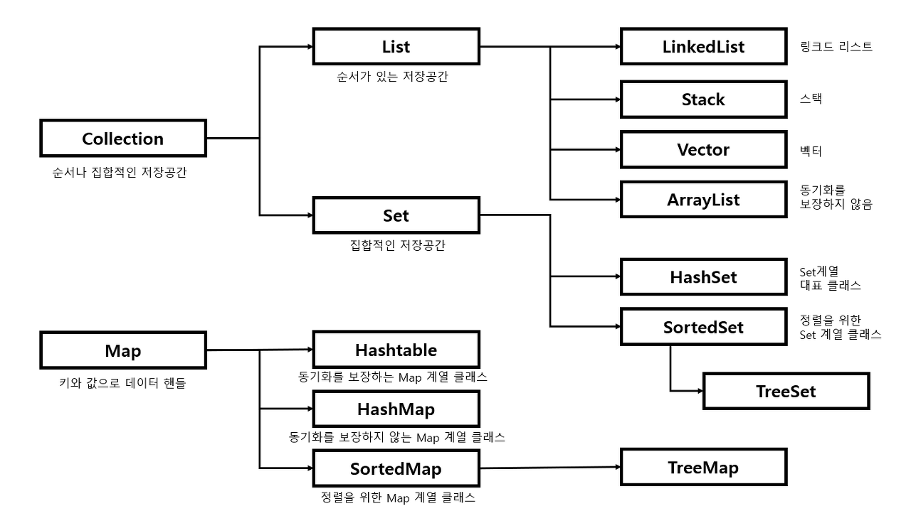

# Data Access

### 목차
- DAO(Data Access Object)
- List
- Map

### 강의 정리
DAO (Data Access Object)
DB의 data에 접근하기 위한 객체이다. DB에 접근하기 위한 로직을 분리하기 위해 사용한다.

데이터베이스 또는 영속성(Persistence) 매커니즘에 데이터 작업(CRUD)을 추상화 인터페이스로 제공하는 패턴이다.

애플리케이션 호출을 영속성 계층과 분리하여, 데이터 작업 시 데이터베이스 세부 정보가 노출하지 않는다.

 
**자바의 컬렉션과 Map**

컬렉션 프레임워크를 사용하는 이유?  
기존에는 많은 데이터를 처리하기 위해 배열을 사용했었지만 크기가 고정되어있고 삽입 및 삭제 시간이 오래 걸린다는 불편한 점들이 많았습니다.  

따라서 이를 보완하기 위해 자바에서 동적 배열 개념인 컬렉션 프레임워크를 제공하였는데 종류는 대표적으로 List, Map, Set이 있습니다. 그리하여 자바 컬렉션 프레임워크로 인해 자료의 삽입, 삭제, 검색 등등이 용이해지고 어떠한 자료형이라도 담을 수 있으며 크기가 자유롭게 늘어난다는 강점을 가져 많은 사람들에게 사용되고 있습니다.

**List**  
순서가 있고 중복을 허용합니다.
인덱스로 원소에 접근이 가능합니다.
크기가 가변적입니다.

List의 종류와 특징
**LinkedList**  

양방향 포인터 구조로 데이터 삽입, 삭제가 빠르다.
ArrayList보다 검색이 느리다.

**ArrayList**  
단반향 포인터 구조로 데이터 순차적 접근에 강점을 가진다.
배열을 기반으로 데이터를 저장한다.
데이터 삽입, 삭제가 느리다.
데이터 검색이 빠르다.

**Map**  
Key와 Value의 한쌍으로 이루어지는 데이터의 집합.
Key에 대한 중복이 없으며 순서를 보장하지 않습니다.
뛰어난 검색 속도를 가집니다.
인덱스가 따로 존재하지 않기 때문에 iterator를 사용합니다.

**Map의 종류와 특징**  

**HashMap**
Key에 대한 중복이 없으며 순서를 보장하지 않는다.
Key와 Value 값으로 NULL을 허용한다.
동기화가 보장되지 않는다.
검색에 가장 뛰어난 성능을 가진다.

**HashTable**
동기화가 보장되어 병렬 프로그래밍이 가능하고 HashMap 보다 처리속도가 느리다.
Key와 Value 값으로 NULL을 허용하지 않는다.

**LinkedHashMap**
입력된 순서를 보장한다.

**TreeMap**
이진 탐색 트리(Red-Black Tree)를 기반으로 키와 값을 저장한다.
Key 값을 기준으로 오름차순 정렬되고 빠른 검색이 가능하다.
저장 시 정렬을 하기 때문에 시간이 다소 오래 걸린다.