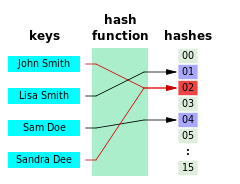

# Hexagonal Architecture

### 목차

* Hexagonal Architecture
* POJO
* [\*\*조영호님의 “우아한객체지향” 세미나](https://youtu.be/dJ5C4qRqAgA) 를 보고 노트에 정리(무조건 보셔야 합니다)\*\*

### 강의 정리

* 헥사고날 아키텍쳐의 등장 배경

DDD에서 구분한 Layered Architecture가 아닌 전통적인 3계층 관점에서 접근해 보면, 우리의 프로그램은 다음과 같은 Flow를 갖게 된다.

1. Presentation
2. Domain
3. Data

이런 구분은 왜 필요할까? **바로 UI와 비즈니스 로직이 뒤섞이는 문제를 해결하기 위해서다.**

이에 대한 해법은 Layered Architecture다. 다만, 기존의 접근법은 User-side와 Database-side를 완전히 다른 것처럼 취급하는 경향이 있다. 하지만 이들을 그저 Application의 외부로 취급하면, 이들은 동일한 구조를 갖게 된다.&#x20;

우리의 프로그램이 다른 외부 요소와 분리돼 테스트하기 쉽고, 재사용하기도 쉬워진다.

애플리케이션과 **어댑터는 포트**로 연결되고, 포트라는 “**인터페이스**”만 잘 사용하면 실제로 그 너머에 있는 어댑터가 정확히 무엇인지 몰라도 된다.

<figure><figcaption></figcaption></figure>

UI Layer에 비즈니스 로직이 없고 Application Layer를 테스트하기 위해 Mocking을 하고 있다면 이미 Hexagonal Architecture를 사용하고 있다고 말할 수 있다. 여기서 한 번 더 Domain Layer를 분리해 Application Layer는 Port에 집중하고, Domain Layer를 Mocking 같은 거 없이 POJO로 테스트하기 쉽고 재사용하기 좋은 객체의 세계로 만든다면 단일 프로그램의 아키텍처 이야기는 더이상 하지 않아도 충분하다.

\| [조영호님의 “우아한객체지향” 세미나](https://youtu.be/dJ5C4qRqAgA) 정리

* 의존성은 변경에 의해서 영향받을 가능성을 말한다.

1. 양방향 의존성을 피하자
2. 설계의 핵심은 의존성이다
3. 설계는 변경에 초점을 맞춘다. 같이 변경되는 코드를 모은다.
4. **관계의 방향 = 협력의 방향 = 의존성의 방향**
5. 의존성은 소스와 타겟이 필요하다.

#### 클래스 의존성의 종류 

**1. 연관관계**

* A에서 B로 이동할 수 있다.
* 연관관계는 영구적인 관계를 맺는다.
* 구현방법 중 하나는 객체 참조가 있다.(위 코드)

**2. 의존관계**

* 파라미터, 리턴 타입에 타입이 나오거나 매서드 안에 타입을 생성한다면 의존관계가 성립된다.
* 의존관계는 일시적으로 관계를 맺는다.

**3. 상속관계**

* B가 바뀔 때 A가 바뀐다.
* 구현이 변경되면 영향을 받는다.

**4. 실체화 관계(인터페이스)**

* 시그니처가 바뀌면 영향을 받는다.

#### 패키지 의존성 

* 간단히 import에 다른 객체가 존재하면 의존성을 가진다고 생각할 수 있다.

\| 객체지향 관련 용어 (일단 외우자)

[https://github.com/ahastudio/til/blob/main/oop/glossary.md](https://github.com/ahastudio/til/blob/main/oop/glossary.md)

